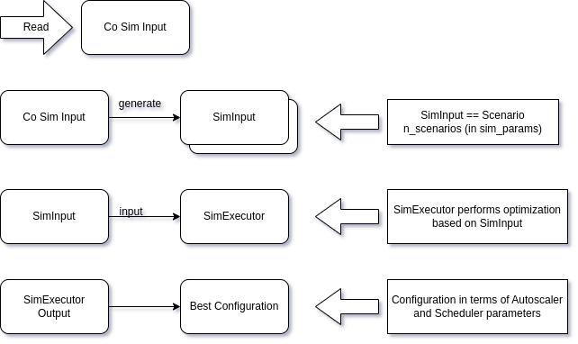

## CoSim Optimization

* `main.py` for end-to-end integration: fetches state from cluster using _galileo-faas_ and _Kubernetes_.
* `mainupdatednotransform.py`: either reads a local RawContext pickle file or starts the optimization process with an empty one.

The following figure highlights the main components and interactions for the simulation-driven optimization approach.

### Co Sim Input

This class encapsulates all parameters to bootstrap the optimization process.
This includes:
* Any orchestration config to start with
  * Includes: autoscaler, global & local scheduler
  * See: `data/orchestration`
* Topology
  * Gets generated in-code by name (i.e., by a factory method taking the argument of Topology as input)
* Sim Executor and parameters
  * Sim Executors execute simulations based on SimInputs (= Scenarios)
  * Each simulation run outputs a collection of data that describes the simulation, such as RTT, resource usage, etc.
  * See: `data/params`
* Target Quality (used to objectively evaluate the outcomes of simulation runs)
  * See: `data/target_qualities`
* Workload
  * The Request Pattern of the simulation
  * Contains multiple clients
  * See: `data/workload`
* Simulation Params
  * Contains parameters concerning simulation runs
  * Such as: duration of simulation (i.e., how long into the future the simulation should simulate ahead)
  * See: `data/sim_params`
* Application/Function params
  * Used to configure functions that are being simulated
  * Such as: image size
  * See: `data/function`

### Loops

CoSim loops (located under `evaluation.cosimulation.loop`) read the co sim configuration (
see `data/cosim-config/random_base.json`)
or CLI parameters and start the CoSim Loop.

Each iteration of these loops boil down to:

1. Initialize PlatformContext and Orchestration Configuration
2. Run the SimExecutor
3. Determine the best configuration based on the quality
4. Process the results
5. Start again

The _offline_ variant initializes an empty PlatformContext and reads the Orchestration Configuration from the JSON
files.
The _online_ variant fetches the PlatformContext and the Autoscaler Orchestration Configuration from the running
autoscaler instances - the remaining Orchestration Configurations are read from the JSON files.

In the _offline_ variant, the _main_ function also allows to modify how many cosim iterations are run before stopping.
The _online_ variant simply runs until a signal is sent.

### Orchestration

The figure above shows a high-level overview of all orchestration components and in the following we lay out the main interactions:

1. Each Autoscaler instances calculates the pressure for a) all clients that are coming from outside of the Autoscaler's zone (external pressure) and b) all clients that reside in the same zone (internal pressure).
   * The functions used to calculate the pressure are defined in the _function parameters_ of each autoscaler (i.e., `pressure_weights`)
2. Autoscaler instances can resolve pressure violations, that stem from internal pressure, on their own. If there are enough resources left in case of a violation coming from too few instances (e.g., performance is bad).
3. After calculating the pressure and resolving local scale actions (to solve pressure violations), each autoscaler sends the pressure values to the Global Scheduler.
   * The method of sending the values to the Global Scheduler depend on the implementation. In the real-world case, values are sent via Redis and in the Simulation via a simpy.Store queue.
4. The Global Scheduler then creates scale actions, based on the previously received pressure values.
   * Internal pressure violations that got resolved the Autoscalers are marked in the pressure value set the Global Scheduler receives (i.e., by a column `solved` containing 0 if it hasn't been resolved and 1 if it has.)
